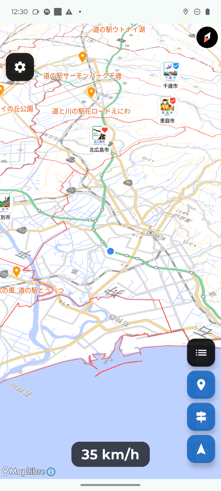
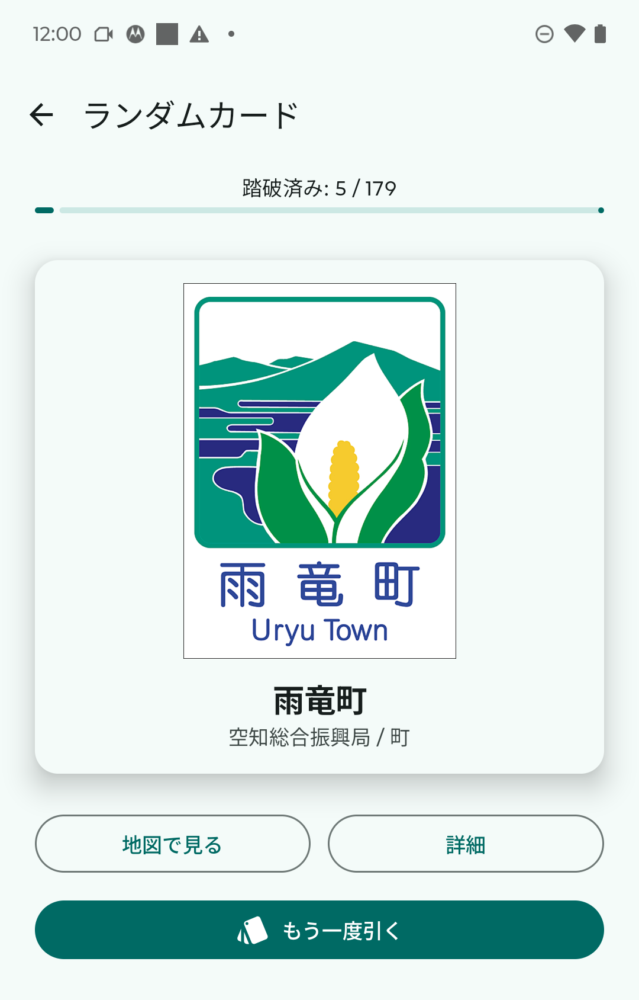
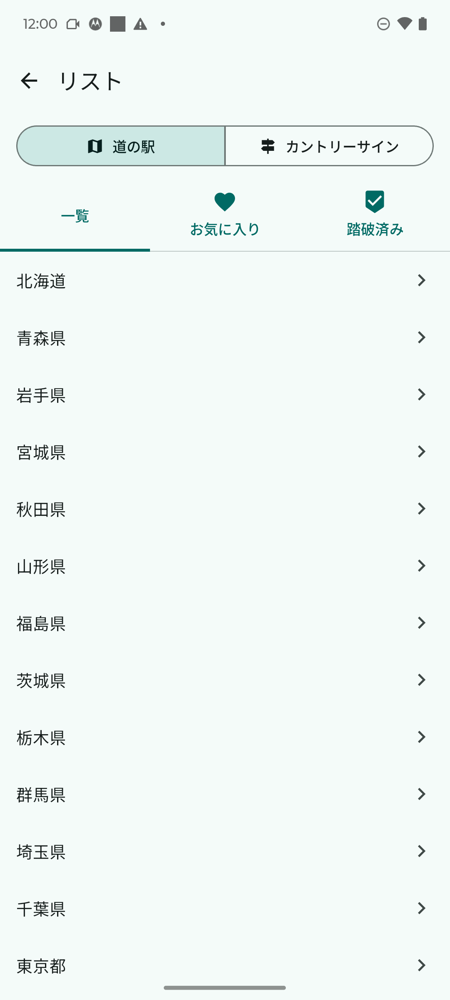
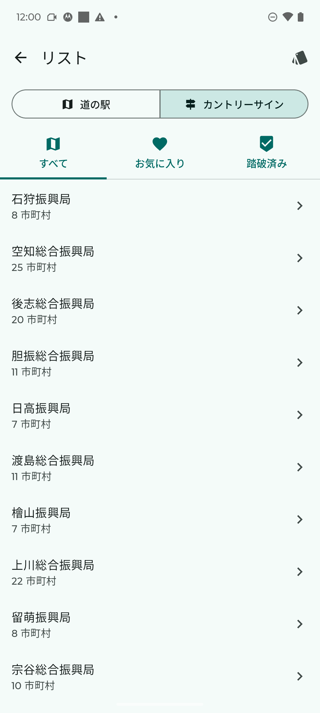

# Michi-navi User Guide (Android)

Michi-navi (道ナビ) is a driving companion app for exploring Hokkaido's roadside stations (michi-no-eki) and country signs. It provides nearby roadside station lists, facility details, photo albums, country sign information, and more.

**Supported version: Michi-navi v2.0.2 (Android 8.0+)**

## Table of Contents

- [Getting Started](#getting-started)
- [Map Screen Layout](#map-screen-layout)
- [Finding Roadside Stations](#finding-roadside-stations)
- [Roadside Station Details](#roadside-station-details)
- [Country Signs](#country-signs)
- [Random Card Draw](#random-card-draw)
- [Favorites & Visited Tracking](#favorites--visited-tracking)
- [List Screen](#list-screen)
- [Settings](#settings)
- [Google Drive Backup](#google-drive-backup)
- [FAQ](#faq)

---

## Getting Started

### Required Permissions

On first launch, the app requests the following permissions:

| Permission | Purpose | Required |
|------------|---------|----------|
| **Location (precise)** | Current position, speed, and heading | Required |
| **Photos & Media** | Photo albums for stations and country signs | When in use |

> **Note:** Location permission "While using the app" works fine, but "Allow all the time" provides more stable tracking during driving.

### Recommended Equipment

- Android smartphone (Android 8.0 / API 26 or later)
- Vehicle mount or stand
- Charging cable (GPS and continuous background location tracking consume significant battery)

---

## Map Screen Layout

The map screen is displayed when you launch the app.

### UI Elements

| Position | Element | Description |
|----------|---------|-------------|
| Top | **Settings button** | Opens [Settings](#settings) |
| Bottom-left | **Speed panel** | Displays current speed (km/h) |
| Bottom-right (or left) | **Control buttons** | See below (position configurable in settings) |

### Control Buttons

| Icon | Function |
|------|----------|
| ☰ List | Opens the [List screen](#list-screen) |
| 🚩 Country signs | Toggles country sign markers on/off |
| ➕ ➖ Zoom | Zoom in/out on the map |
| 📍 Current location | Re-centers the map and returns to heading-up mode |

### Speed-Based Auto-Zoom

While driving, the map zoom level automatically adjusts based on your speed.

| Speed | Approximate view range |
|-------|------------------------|
| Stopped (<5 km/h) | ~120 km |
| Urban (5–30 km/h) | ~18 km |
| Suburban (30–60 km/h) | ~36 km |
| Highway (60–100 km/h) | ~60 km |
| Expressway (>100 km/h) | ~84 km |

### Heading-Up Mode

While driving, the map automatically rotates so your direction of travel is always pointing up. After manual map interaction, tap the **current location button** to return to heading-up mode.

### Marker Colors

| Color | Meaning |
|-------|---------|
| Orange | Regular roadside station |
| Red (heart) | Favorited station |
| Blue (check) | Visited station |
| Red + shield | Both favorited and visited |

---

## Finding Roadside Stations

### Nearby Stations

The app automatically searches for roadside stations **within 100 km** of your current location and displays them as markers on the map.

- Driving (above 5 km/h): Prioritizes stations in your **direction of travel (±45° cone)**
- Stopped: Shows stations in all directions
- Up to 10 stations, sorted by distance

### Tap a Station Marker

Tapping a station marker on the map opens the [Station Details](#roadside-station-details) sheet.

### Browse from the List

Open the [List screen](#list-screen) via the ☰ button, and filter by prefecture or municipality.

---

## Roadside Station Details

Tapping a station marker or selecting a station from the list opens the details sheet.

### Information Displayed

- **Photo** — Representative image of the station
- **Favorite button (♡)** — Heart icon to bookmark
- **Visited button (✓)** — Shield checkmark to mark as visited
- **Basic info** — Distance (km/m), cardinal direction, road name, location (prefecture/municipality)
- **Facility icons** — Shows available amenities using 18 distinct icons
- **Photo album** — Save up to 3 photos per station
- **External navigation** — Launches Google Maps for route guidance

### Facility Icons

| Icon | Facility | Icon | Facility |
|------|----------|------|----------|
| 🏧 | ATM | 🍴 | Restaurant |
| ♨ | Hot spring (onsen) | ⚡ | EV charger |
| 📶 | Wi-Fi | 🍼 | Baby room |
| ♿ | Accessible toilet | ℹ | Information |
| 🛍 | Shop | 🎨 | Experience/workshop |
| 🏛 | Museum | 🌳 | Park |
| 🏨 | Hotel | 🚐 | RV park |
| 🐕 | Dog run | 🚲 | Bicycle rental |
| ⛺ | Campground | 👣 | Footbath |

### External Navigation

The navigation button in the details sheet launches Google Maps with directions to the station. If multiple navigation apps are installed, Android's app chooser will appear.

### Photo Album

You can save up to 3 photos per station.

1. **Add a photo:** Tap an empty slot (+ icon) → select from Gallery
2. **View photos:** Tap a thumbnail → fullscreen view
3. **Delete a photo:** Tap the delete icon

> **Note:** Photos are stored locally on your device, but if you set up **Google Drive Backup**, photos can also be backed up to the cloud. See [Google Drive Backup](#google-drive-backup).

---

## Country Signs

**Country signs (カントリーサイン)** are decorative signs installed at municipal boundaries that showcase each region's unique character. Michi-navi includes all **179 Hokkaido municipalities'** country signs.

### Enabling Country Sign Markers

Toggle the 🚩 button on the map to show/hide country sign markers.

### Tap a Country Sign Marker

Tapping a marker opens the country sign details sheet.

### Information Displayed

- **Country sign image** — Actual sign design
- **Favorite (♡) / Visited (✓) buttons** — Same as roadside stations
- **Sign info** — Name (kanji/kana), design motif, origin story
- **Municipality info** — Subprefecture, type (city/town/village), population, area
- **Town flower** — Flower name, description, image
- **Tourism link** — Link to the municipality's tourism website

---

## Random Card Draw

A gacha-style feature that randomly draws one unvisited country sign. Like the dice journey from the popular Japanese show "Suiyōbi no Downtown," you can leave the next destination to chance.

### How to Use

1. Tap the **🃏 "Draw a card"** button in the Country Signs tab of the List screen.
2. With animation, a random unvisited country sign appears.
3. From the card, you can:
   - **Draw another** — Randomly display a different sign
   - **View on map** — Return to the map showing the sign's location
   - **View details** — Open the country sign details sheet

### All Municipalities Complete

When you've visited all 179 municipalities, **"All 179 municipalities conquered!"** is displayed.

---

## Favorites & Visited Tracking

Roadside stations and country signs are tracked independently.

### Favorites (♡)

**Purpose:** Bookmark places you want to visit or find interesting.

- Tap the heart icon in the station or country sign details sheet
- The marker on the map turns **red**
- View them in the "Favorites" tab of the List screen

### Visited (✓)

**Purpose:** Stamp rally style record of places you've actually been to.

- Tap the shield check icon in the details sheet
- The marker on the map turns **blue** (color changes for country signs when visited)
- View them in the "Visited" tab of the List screen

> **Important:** Roadside station favorites/visited and country sign favorites/visited are **tracked separately**.

---

## List Screen

Open the list screen via the ☰ button on the map.

### Tab Switching

The tabs at the top switch between **Roadside Stations** and **Country Signs**.

### Roadside Stations Tab

| Subtab | Content |
|--------|---------|
| **All Stations** | 3-level filter: Prefecture → Municipality → Station |
| **Favorites** | Stations with hearts |
| **Visited** | Visited stations |

### Country Signs Tab

| Subtab | Content |
|--------|---------|
| **All Signs** | Filter by subprefecture (14 regional divisions) |
| **Favorites** | Favorited country signs |
| **Visited** | Visited country signs |
| **🃏 Draw a card** | [Random Card Draw](#random-card-draw) feature |

---

## Settings

Open settings via the settings button on the map screen.

### Map Tile Selection

| Tile | Description |
|------|-------------|
| **GSI Pale** | Japan Geospatial Information Authority pale map (default, clear colors) |
| **GSI Standard** | GSI standard map |
| **GSI Satellite** | GSI aerial photography |
| **OpenFreeMap** | Open-source vector maps (no API key required) |
| **Google Maps** | Google Maps (requires API key) |

### Zoom Button Position

Choose "left" or "right" to move the zoom buttons. Placing them on the opposite side of your steering hand makes one-handed operation easier.

### Country Sign Markers Toggle

You can also toggle country sign markers on/off from the settings screen.

### Google Maps API Key Setup

To use Google Maps tiles, you must **obtain a Google Cloud API key yourself**.

1. Create a project in [Google Cloud Console](https://console.cloud.google.com/).
2. Enable the **Map Tiles API**.
3. Issue an API key.
4. In Michi-navi Settings, paste the key into the **Google Maps API Key** field.
5. The eye icon toggles key visibility.
6. The delete button removes the key (Michi-navi automatically reverts to GSI Pale).

> **Caution:** Google Maps API usage may incur charges. Please review Google Cloud pricing. Use at your own risk.
>
> **Note:** If the API key is invalid or missing, Michi-navi automatically falls back to GSI Pale even if Google Maps is selected.

---

## Google Drive Backup

The Android version includes a feature to back up your data (favorites, visited records, photos) to Google Drive.

### Initial Setup

1. Open the **Google Drive Backup** section in Settings.
2. Tap **Sign in with Google** and select the Google account to back up to.
3. Approve the access permissions.

### Manual Backup

Tapping **Run Backup** uploads the following data to Google Drive:

- Favorited roadside stations and country signs
- Visited roadside stations and country signs
- Photo album images
- App settings (map tile selection, zoom button position, etc.)

### Automatic Backup

When you change settings or add new photos, a backup is automatically scheduled (executed via WorkManager).

### Restore

When you install Michi-navi on another device and sign in with the same Google account, a **Restore** button appears. Tap it to restore all data from the backup.

### Last Sync Time

The settings screen displays when the last successful backup occurred.

> **Note:** Backups are saved as ZIP files in Google Drive's app-specific folder, which users cannot access directly.

---

## FAQ

### Q. The speed display doesn't match my actual speed.

The app displays instantaneous GPS-based speed, so there may be discrepancies in tunnels or areas with poor reception.

### Q. Are photos stored in the cloud?

**Yes, if you set up Google Drive Backup.** Without backup, photos are stored only on your device and will be lost if you uninstall the app. See [Google Drive Backup](#google-drive-backup) for details.

### Q. Roadside station markers don't appear.

Check the following:

1. Is location permission enabled?
2. Are there roadside stations within 100 km? (Markers don't appear in areas without roadside stations.)

### Q. Battery drains quickly.

GPS and background location tracking while driving consume significant battery. A vehicle charging cable is recommended.

### Q. Are there country signs in other prefectures?

Country signs exist at municipal boundaries nationwide, but Michi-navi currently only includes **Hokkaido's 179 municipalities**.

### Q. Google Maps tiles don't appear when I select Google Maps.

Your API key may not be configured correctly, or the **Map Tiles API** may not be enabled. In this case, Michi-navi automatically falls back to GSI Pale. Please check your API key and its activation status in Google Cloud Console.

### Q. The zoom buttons are hard to reach.

You can change the zoom button position to "left" or "right" in Settings. Placing them on the opposite side of your steering hand makes one-handed operation easier.

### Q. The same sign keeps appearing in the random card draw.

Signs marked as visited are excluded from the draw. After actually visiting a sign, don't forget to mark it as visited.
