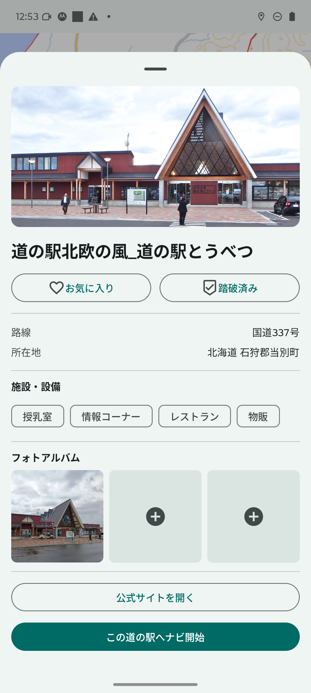
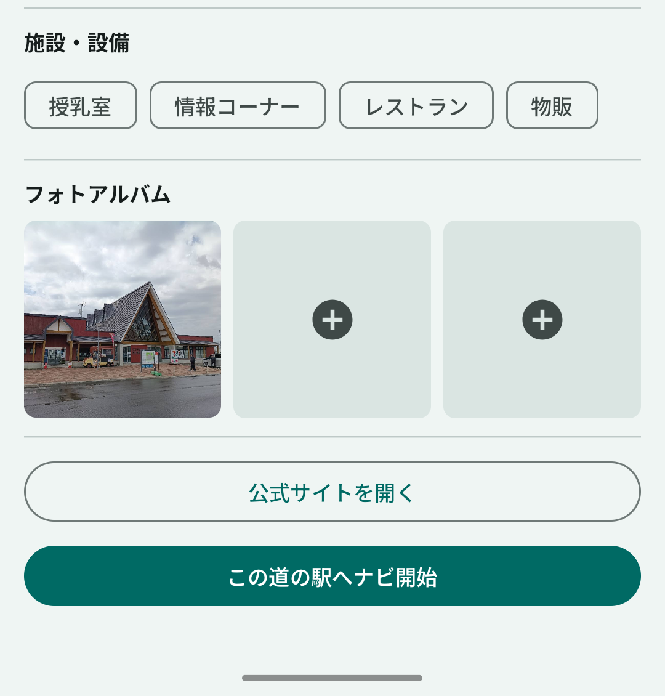
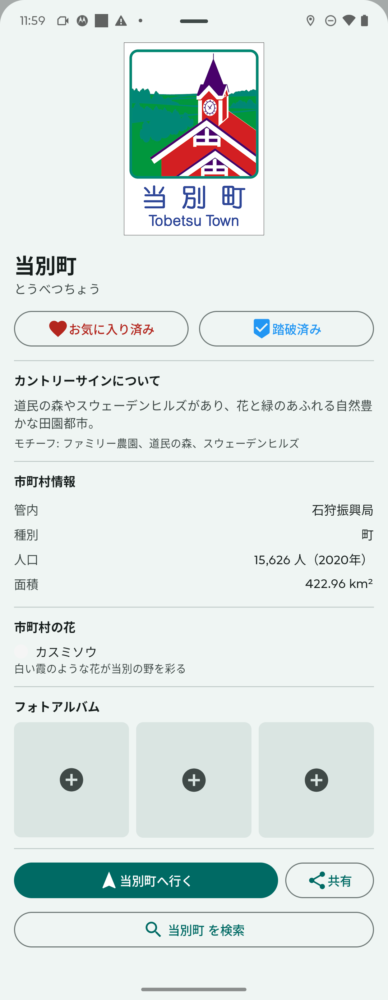
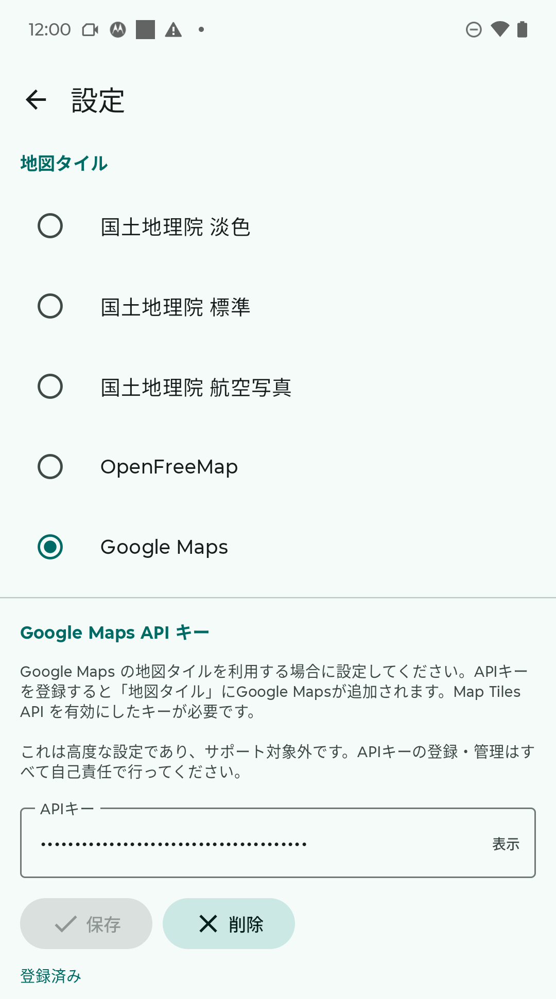
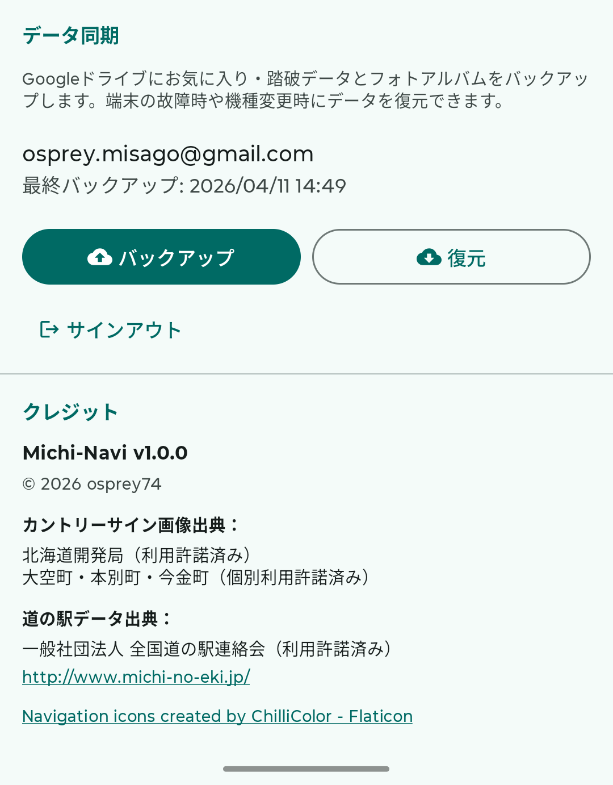

# Michi-navi 操作マニュアル（Android版）

Michi-navi（道ナビ）は、北海道の道の駅・カントリーサインを巡るドライビングコンパニオンアプリです。現在地周辺の道の駅一覧、施設詳細、フォトアルバム、カントリーサイン情報などを提供します。

**対応バージョン: Michi-navi v2.0.2（Android 8.0 以降）**

## 目次

- [はじめに](#はじめに)
- [地図画面の基本構成](#地図画面の基本構成)
- [道の駅を探す](#道の駅を探す)
- [道の駅の詳細画面](#道の駅の詳細画面)
- [カントリーサイン](#カントリーサイン)
- [ランダムカードドロー](#ランダムカードドロー)
- [お気に入り・訪問済み管理](#お気に入り訪問済み管理)
- [リスト画面](#リスト画面)
- [設定](#設定)
- [Google Drive バックアップ](#google-drive-バックアップ)
- [よくある質問](#よくある質問)

---

## はじめに

### 必要な権限

初回起動時、以下の権限を求められます：

| 権限 | 用途 | 必須度 |
|------|------|--------|
| **位置情報（正確な位置情報）** | 現在地・速度・進行方向の取得 | 必須 |
| **写真・メディア** | 道の駅・カントリーサインのフォトアルバム | 使用時のみ |

> **補足:** 位置情報は「アプリの使用中のみ許可」でも動作しますが、「常に許可」にすることで運転中の継続追跡がより安定します。

### 用意するもの

- Android スマートフォン（Android 8.0 / API 26 以降）
- 車載スタンドやマウント（推奨）
- 充電ケーブル（GPSとバックグラウンド位置情報の常時取得は電池消費が大きいため）

---

## 地図画面の基本構成

アプリを起動すると、地図画面が表示されます。

### 画面の構成要素

| 位置 | 要素 | 説明 |
|------|------|------|
| 上部 | **設定ボタン** | [設定画面](#設定)を開きます |
| 左下 | **速度表示パネル** | 現在の速度（km/h）を表示 |
| 右下（または左下） | **コントロールボタン** | 下記参照（設定で左右切替可能） |

### コントロールボタン

| アイコン | 機能 |
|----------|------|
| ☰ リスト | [リスト画面](#リスト画面)を開く |
| 🚩 カントリーサイン | カントリーサインマーカーの表示/非表示を切り替え |
| ➕ ➖ ズーム | 地図の拡大・縮小 |
| 📍 現在地 | 地図を現在地に戻す（ヘディングアップに復帰） |

### 速度連動オートズーム

運転中、速度に応じて地図の表示範囲が自動で変化します。

| 速度 | 表示範囲（目安） |
|------|------------------|
| 停車中（〜5 km/h） | 約 120 km |
| 市街地（5〜30 km/h） | 約 18 km |
| 郊外（30〜60 km/h） | 約 36 km |
| 高速道路（60〜100 km/h） | 約 60 km |
| 高速走行（100 km/h〜） | 約 84 km |

### ヘディングアップ表示

走行中は進行方向が常に上になるように地図が回転します。手動で地図を操作した後は、**現在地ボタン** をタップしてヘディングアップに戻ります。

### マーカーの色分け

| 色 | 意味 |
|----|------|
| オレンジ | 通常の道の駅 |
| 赤（ハート） | お気に入りの道の駅 |
| 青（チェック） | 訪問済みの道の駅 |
| 赤＋シールド | お気に入りかつ訪問済みの道の駅 |

---

## 道の駅を探す

### 近くの道の駅を見る

アプリは自動的に **現在地から100km以内** の道の駅を検索し、地図上にマーカーで表示します。

- 運転中（速度5km/h以上）: **進行方向（±45°の範囲）** の道の駅を優先表示
- 停車中: 周囲全方向の道の駅を表示
- 最大10件まで距離順で表示

### 道の駅マーカーをタップする

地図上の道の駅マーカーをタップすると、[道の駅の詳細画面](#道の駅の詳細画面)がボトムシートで開きます。

### リストから探す

地図画面の ☰ ボタンから [リスト画面](#リスト画面) を開き、都道府県や市町村を絞り込んで道の駅を探せます。

---

## 道の駅の詳細画面

道の駅マーカーをタップするか、リスト画面で道の駅を選択すると、詳細画面がボトムシートで開きます。

### 表示される情報

- **写真** — 道の駅の代表写真
- **お気に入りボタン（♡）** — ハートアイコンでお気に入り登録
- **訪問済みボタン（✓）** — チェックシールドで訪問記録
- **基本情報** — 距離（km/m）、方角、道路名、所在地（都道府県・市町村）
- **施設アイコン** — 下記の18種類のアイコンで施設を表示
- **フォトアルバム** — 最大3枚まで写真を保存可能
- **外部ナビ連携** — Google Maps による案内開始

### 施設アイコン一覧

| アイコン | 施設 | アイコン | 施設 |
|---------|------|---------|------|
| 🏧 | ATM | 🍴 | レストラン |
| ♨ | 温泉 | ⚡ | EV充電 |
| 📶 | Wi-Fi | 🍼 | ベビールーム |
| ♿ | 多目的トイレ | ℹ | 案内所 |
| 🛍 | 売店 | 🎨 | 体験施設 |
| 🏛 | 博物館 | 🌳 | 公園 |
| 🏨 | 宿泊施設 | 🚐 | RVパーク |
| 🐕 | ドッグラン | 🚲 | レンタサイクル |
| ⛺ | キャンプ場 | 👣 | 足湯 |

### 外部ナビアプリで案内

詳細画面のナビボタンから、Google Maps で道の駅までの案内を開始できます。複数のナビアプリがインストールされている場合は、Android 標準のアプリ選択ダイアログが表示されます。

### フォトアルバム機能

各道の駅ごとに最大3枚まで写真を保存できます。

1. **写真の追加**: アルバムの空きスロット（+ アイコン）をタップ → ギャラリーから選択
2. **写真の表示**: サムネイルをタップ → フルスクリーン表示
3. **写真の削除**: 削除アイコンをタップ

> **補足:** 写真は端末内に保存されますが、**Google Drive バックアップ** を設定すれば写真も含めてクラウドに保存できます（[Google Drive バックアップ](#google-drive-バックアップ)参照）。

---

## カントリーサイン

**カントリーサイン（市町村サイン）** は、市町村の境界に設置された、地域の特徴をデザインした看板です。北海道の **179市町村** のカントリーサインを収録しています。

### カントリーサインマーカーを表示

地図画面の 🚩 ボタンで表示/非表示を切り替えます。有効にすると、地図上に市町村のカントリーサインマーカーが表示されます。

### カントリーサインマーカーをタップする

マーカーをタップすると、カントリーサインの詳細画面がボトムシートで開きます。

### 表示される情報

- **カントリーサインの画像** — 実際のサインのデザイン
- **お気に入りボタン（♡）** / **訪問済みボタン（✓）** — 道の駅と同様
- **サイン情報** — 名称（漢字・かな）、デザインのモチーフ、由来
- **市町村情報** — 振興局、種別（市/町/村）、人口、面積
- **町の花** — 花の名前、説明、画像
- **観光情報サイト** — 市町村の観光サイトへのリンク

---

## ランダムカードドロー

未訪問のカントリーサインをランダムで1枚引く、ガチャ風の機能です。「水曜どうでしょう」のサイコロの旅のように、次に訪れる市町村を運任せで決める楽しみがあります。

### 使い方

1. リスト画面のカントリーサインタブで **🃏 「カードを引く」** ボタンをタップします。
2. アニメーションと共に、未訪問のカントリーサインがランダムで1枚表示されます。
3. カードから以下の操作が可能です：
   - **もう一枚引く** — 別のサインをランダム表示
   - **地図で見る** — 地図に戻ってサインの位置を表示
   - **詳細を見る** — カントリーサインの詳細画面を開く

### 全市町村訪問達成

179市町村すべてを訪問済みにすると、**「全179市町村を制覇しました！」** のメッセージが表示されます。

---

## お気に入り・訪問済み管理

道の駅とカントリーサインは、それぞれ独立してお気に入り・訪問済みを管理できます。

### お気に入り（♡）

**用途:** 「今度行きたい」「興味がある」場所をブックマーク

- 道の駅の詳細画面またはカントリーサインの詳細画面でハートアイコンをタップ
- 地図上のマーカーが **赤色** に変わります
- リスト画面の「お気に入り」タブで一覧表示

### 訪問済み（✓）

**用途:** 「実際に訪れた」場所を記録するスタンプラリー機能

- 詳細画面でチェックシールドアイコンをタップ
- 地図上のマーカーが **青色** に変わります（カントリーサインは訪問済みで色が変化）
- リスト画面の「訪問済み」タブで一覧表示

> **重要:** 道の駅のお気に入り/訪問済みと、カントリーサインのお気に入り/訪問済みは**別々に管理**されます。

---

## リスト画面

地図画面の ☰ ボタンからリスト画面を開きます。

### タブ切り替え

上部のタブで **道の駅** と **カントリーサイン** を切り替えます。

### 道の駅タブ

| サブタブ | 内容 |
|----------|------|
| **すべての道の駅** | 都道府県 → 市町村 → 道の駅 の3階層で絞り込み |
| **お気に入り** | ハートを付けた道の駅 |
| **訪問済み** | 訪問済みの道の駅 |

### カントリーサインタブ

| サブタブ | 内容 |
|----------|------|
| **すべてのサイン** | 振興局（14区分）で絞り込んで一覧表示 |
| **お気に入り** | ハートを付けたカントリーサイン |
| **訪問済み** | 訪問済みのカントリーサイン |
| **🃏 カードを引く** | [ランダムカードドロー](#ランダムカードドロー)機能 |

---

## 設定

地図画面の設定ボタンから設定画面を開きます。

### 地図タイルの選択

| タイル | 説明 |
|--------|------|
| **GSI 淡色** | 国土地理院の淡色地図（デフォルト、見やすい色合い） |
| **GSI 標準** | 国土地理院の標準地図 |
| **GSI 衛星写真** | 国土地理院の航空写真 |
| **OpenFreeMap** | オープンソースのベクター地図（APIキー不要） |
| **Google Maps** | Google マップ（APIキーが必要） |

### ズームボタンの位置

「左」または「右」を選択して、ズームボタンの位置を変更できます。ハンドルを握る手と反対側に配置すると片手操作しやすくなります。

### カントリーサインマーカーの表示

設定画面からもカントリーサインマーカーの表示/非表示を切り替えられます。

### Google Maps API キーの設定

Google Maps タイルを使用するには、**ユーザー自身で Google Cloud の API キーを取得** する必要があります。

1. [Google Cloud Console](https://console.cloud.google.com/) でプロジェクトを作成
2. **Map Tiles API** を有効化
3. API キーを発行
4. Michi-navi の設定画面で **Google Maps API キー** の入力欄にキーを貼り付け
5. 目のアイコンでキーの表示/非表示を切り替え可能
6. 削除ボタンでキーを削除（削除時は自動で GSI 淡色に戻ります）

> **注意:** Google Maps API の利用には料金が発生する場合があります。詳細は Google Cloud の料金体系をご確認ください。本機能は自己責任でご利用ください。
>
> **補足:** APIキーが無効または未入力の場合、Google Maps を選択していても自動的に GSI 淡色にフォールバックします。

---

## Google Drive バックアップ

Android版には、設定データ（お気に入り、訪問済み、写真）を Google Drive にバックアップする機能があります。

### 初回設定

1. 設定画面の **Google Drive バックアップ** セクションを開きます。
2. **Google アカウントでログイン** をタップして、バックアップ先の Google アカウントを選択します。
3. アクセス権限を承認します。

### 手動バックアップ

**バックアップを実行** ボタンをタップすると、以下のデータがまとめて Google Drive に保存されます：

- お気に入りの道の駅・カントリーサイン
- 訪問済みの道の駅・カントリーサイン
- フォトアルバムの写真
- アプリ設定（地図タイル選択、ズームボタン位置など）

### 自動バックアップ

設定変更や新しい写真の追加時に、自動的にバックアップがスケジュールされます（WorkManager による実行）。

### 復元

別の端末にインストールした Michi-navi で、同じ Google アカウントにログインすると、**復元** ボタンが表示されます。これをタップすると、バックアップからすべてのデータを復元できます。

### 最終同期日時

設定画面には、最後にバックアップが成功した日時が表示されます。

> **補足:** バックアップは ZIP 形式で Google Drive のアプリ専用フォルダに保存され、ユーザーが直接アクセスすることはできません。

---

## よくある質問

### Q. 速度表示が実際と違うことがあります

GPS 由来の瞬間速度を表示しているため、トンネル内や電波の悪い場所では誤差が出ることがあります。

### Q. 写真はクラウドに保存されますか？

**Google Drive バックアップを設定していれば保存されます。** バックアップ未設定の場合、写真は端末内のみに保存され、アプリをアンインストールすると失われます。詳しくは [Google Drive バックアップ](#google-drive-バックアップ) をご覧ください。

### Q. 道の駅マーカーが表示されません

以下を確認してください：

1. 位置情報の権限が有効になっているか
2. 周辺100km以内に道の駅があるか（道の駅がない地域では表示されません）

### Q. バッテリー消費が激しい

運転中の GPS とバックグラウンド位置情報取得は電池を多く消費します。車載充電ケーブルの利用を推奨します。

### Q. カントリーサインは他の都道府県にもありますか？

カントリーサインは全国の市町村境界に存在しますが、Michi-navi では現在 **北海道179市町村** のみ収録しています。

### Q. Google Maps を選択してもタイルが表示されません

APIキーが正しく設定されていないか、**Map Tiles API** が有効化されていない可能性があります。その場合、自動的に GSI 淡色にフォールバックします。Google Cloud Console でAPIキーと有効化状態をご確認ください。

### Q. ズームボタンが操作しづらい

設定画面の **ズームボタンの位置** で左右を切り替えられます。ハンドルを握る手と反対側に配置すると、片手で操作しやすくなります。

### Q. ランダムカードドローで同じサインが出てしまいます

訪問済みとしてマークされたサインは抽選対象から除外されます。サインを引いた後、実際に訪問したら忘れずに訪問済みマークを付けてください。
